# Codex 运行流程

本文档详细说明 Codex 从用户输入到代码修改的完整执行流程。

## 目录

- [架构概览](#架构概览)
- [核心概念](#核心概念)
- [通信协议](#通信协议)
- [完整流程示例](#完整流程示例)
- [核心组件详解](#核心组件详解)
- [代码位置索引](#代码位置索引)

---

## 架构概览

Codex 采用分层架构，通过队列对（Queue Pair）模式实现 UI 层与核心引擎的解耦通信。

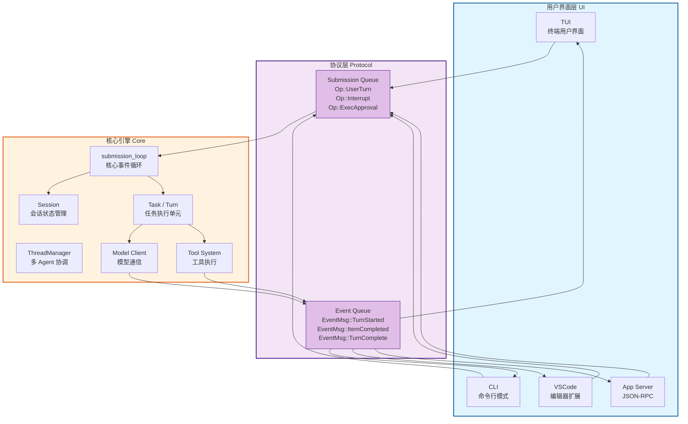

---

## 核心概念

### Session / Task / Turn 关系

Codex 使用三层嵌套结构来组织执行单元：

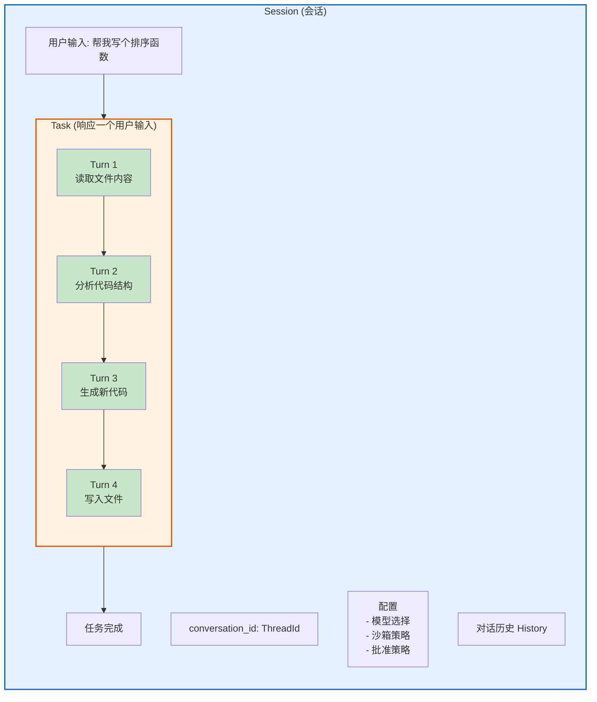

**说明：**

| 概念 | 定义 | 生命周期 |
|------|------|----------|
| **Session** | 一个完整的会话，包含配置、状态和历史记录 | 从 `Op::ConfigureSession` 开始，直到程序关闭 |
| **Task** | 响应单个用户输入的工作单元，由多个 Turn 组成 | 从 `Op::UserTurn` 开始，到任务完成或被中断 |
| **Turn** | 任务的一次迭代循环，包含一次模型请求和响应处理 | 模型请求 → 工具执行 → 结果返回 |

---

## 通信协议

### Submission Queue / Event Queue 通信流程

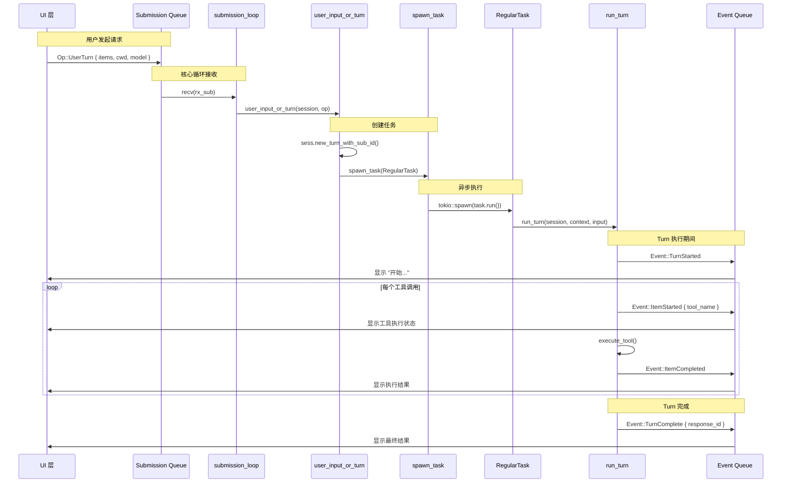

### 消息类型

#### Op (Submission Queue - UI → Core)

| Op 变体 | 用途 | 触发时机 |
|---------|------|----------|
| `ConfigureSession` | 初始化/配置会话 | 程序启动或配置变更 |
| `UserTurn` | 用户输入（新格式） | 用户发送消息 |
| `UserInput` | 用户输入（旧格式） | 兼容旧版本 |
| `Interrupt` | 中断当前任务 | 用户取消操作 |
| `ExecApproval` | 批准/拒绝命令执行 | 命令需要批准 |
| `UserInputAnswer` | 回答工具输入请求 | 工具需要用户输入 |
| `ListSkills` | 列出可用技能 | UI 请求技能列表 |

#### EventMsg (Event Queue - Core → UI)

| EventMsg 变体 | 用途 |
|---------------|------|
| `TurnStarted` | Turn 开始执行 |
| `ItemStarted` | 工具开始执行 |
| `ContentDelta` | 流式内容更新 |
| `ItemCompleted` | 工具执行完成 |
| `AgentMessage` | 模型返回的消息 |
| `ExecApprovalRequest` | 请求批准命令执行 |
| `RequestUserInput` | 请求用户输入 |
| `TurnComplete` | Turn 完成 |
| `Error` | 错误信息 |
| `Warning` | 警告信息 |

---

## 完整流程示例

### 用户请求 "帮我写一个快速排序函数"

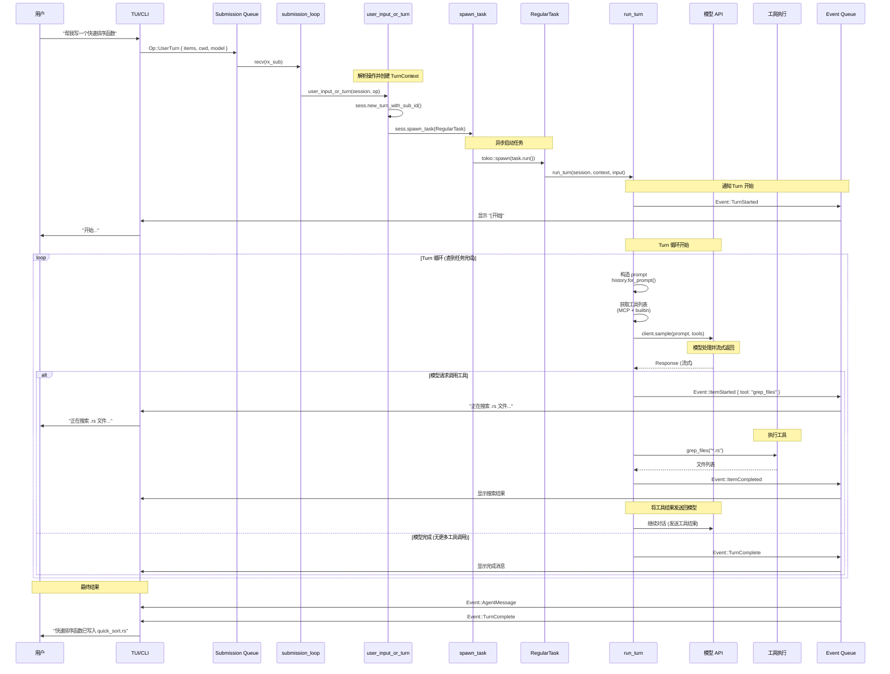

---

## 核心组件详解

### submission_loop 流程

`submission_loop` 是 Codex 的核心事件循环，位于 `codex-rs/core/src/codex.rs:1997`。

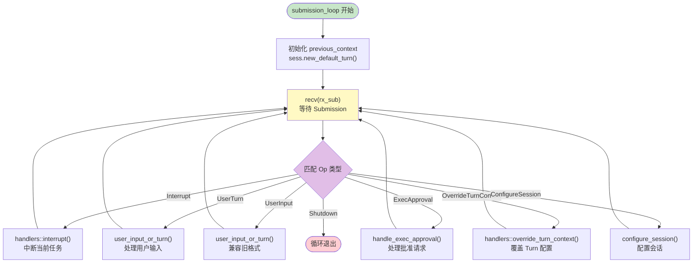

### user_input_or_turn 流程

`user_input_or_turn` 负责处理用户输入并启动新任务，位于 `codex-rs/core/src/codex.rs:2203`。

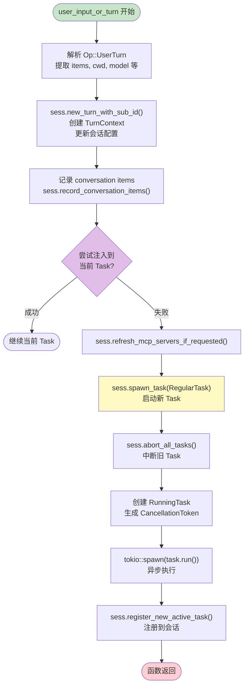

### spawn_task 流程

`spawn_task` 负责创建并启动新的异步任务，位于 `codex-rs/core/src/tasks/mod.rs:111`。

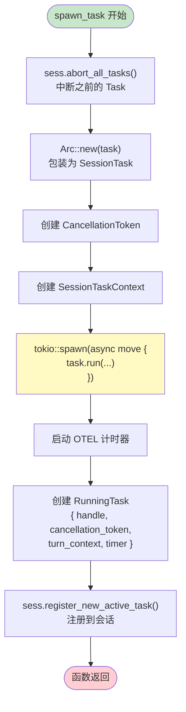

### Turn 循环流程

`run_turn` 是 Turn 执行的核心函数，位于 `codex-rs/core/src/codex.rs:2790`。

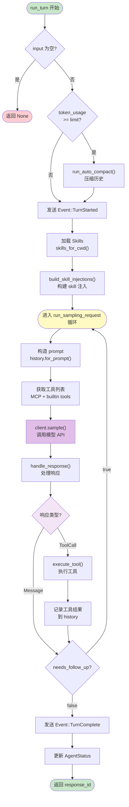

### 工具执行流程

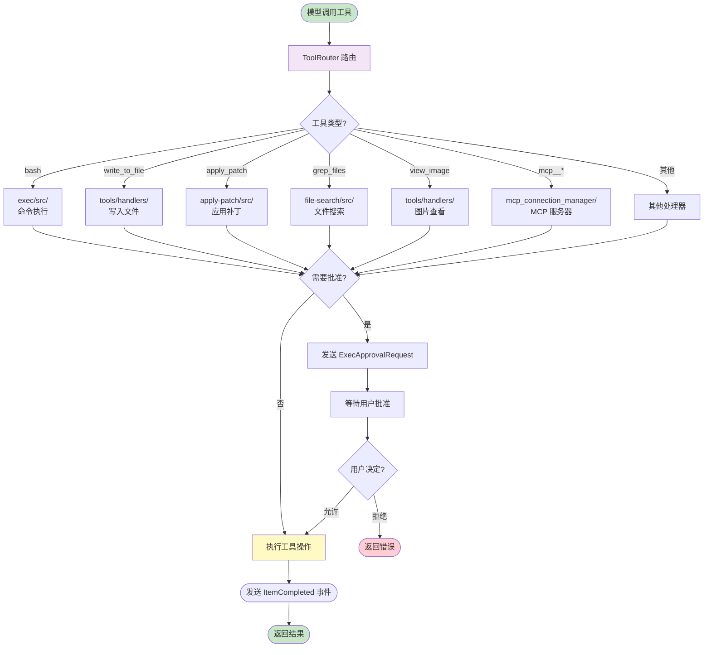

### 模型调用流程

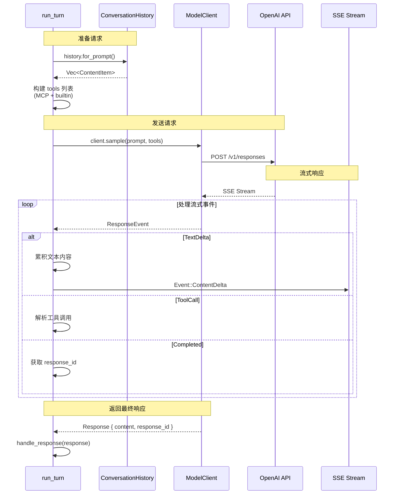

### 函数调用链

从用户输入到具体函数执行的完整调用链：

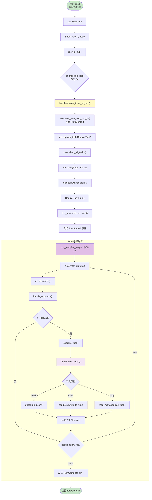

---

## 代码位置索引

### 核心流程文件

| 文件 | 行号 | 函数/结构 | 说明 |
|------|------|-----------|------|
| `codex-rs/core/src/codex.rs` | 1997 | `submission_loop` | 核心事件循环，处理所有 Op |
| `codex-rs/core/src/codex.rs` | 2203 | `user_input_or_turn` | 处理用户输入，启动 Task |
| `codex-rs/core/src/codex.rs` | 2790 | `run_turn` | 执行一个 Turn，包含模型调用循环 |
| `codex-rs/core/src/codex.rs` | - | `Session` | 会话状态管理结构体 |
| `codex-rs/core/src/codex.rs` | - | `TurnContext` | Turn 执行上下文 |

### Task 管理

| 文件 | 行号 | 函数/结构 | 说明 |
|------|------|-----------|------|
| `codex-rs/core/src/tasks/mod.rs` | 111 | `spawn_task` | 创建并启动新 Task |
| `codex-rs/core/src/tasks/mod.rs` | 170 | `abort_all_tasks` | 中断所有运行中的 Task |
| `codex-rs/core/src/tasks/mod.rs` | 177 | `on_task_finished` | Task 完成回调 |
| `codex-rs/core/src/tasks/regular.rs` | 24 | `RegularTask::run` | 常规 Task 的 run 实现 |

### 模型通信

| 文件 | 行号 | 函数/结构 | 说明 |
|------|------|-----------|------|
| `codex-rs/core/src/client.rs` | - | `ModelClient` | 模型 API 客户端 |
| `codex-rs/core/src/client.rs` | - | `sample()` | 调用模型 API |
| `codex-rs/core/src/history.rs` | - | `ConversationHistory` | 对话历史管理 |

### 工具系统

| 文件 | 说明 |
|------|------|
| `codex-rs/core/src/tools/mod.rs` | 工具系统入口，ToolRouter |
| `codex-rs/core/src/tools/handlers.rs` | 内置工具处理器 |
| `codex-rs/exec/src/` | bash 命令执行 |
| `codex-rs/file-search/src/` | 文件搜索工具 |
| `codex-rs/apply-patch/src/` | patch 应用 |
| `codex-rs/core/src/mcp_connection_manager.rs` | MCP 连接管理 |

### 通信协议

| 文件 | 说明 |
|------|------|
| `codex-rs/protocol/src/protocol.rs` | Op 枚举（用户操作） |
| `codex-rs/protocol/src/protocol.rs` | EventMsg 枚举（事件消息） |
| `codex-rs/protocol/src/lib.rs` | 队列类型定义 |

### Agent 相关

| 文件 | 行号 | 函数/结构 | 说明 |
|------|------|-----------|------|
| `codex-rs/core/src/agent.rs` | - | `AgentStatus` | Agent 状态枚举 |
| `codex-rs/core/src/agent.rs` | - | `CollaborationMode` | 协作模式配置 |

---

## 数据流图

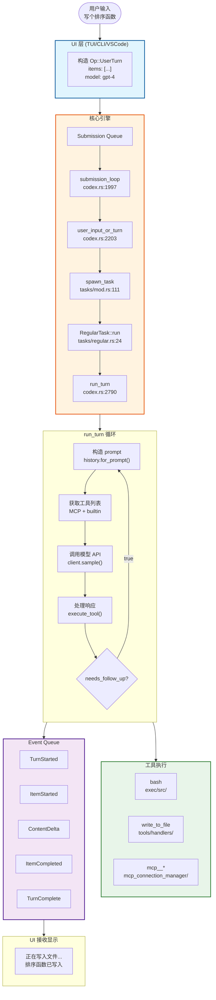

---

## 总结

Codex 的执行流程可以概括为以下步骤：

1. **用户输入** → UI 构造 `Op::UserTurn` 发送到 Submission Queue
2. **submission_loop** 接收 Op 并路由到对应的 handler
3. **user_input_or_turn** 解析输入，创建 TurnContext
4. **spawn_task** 中断旧 Task，启动新的 RegularTask
5. **run_turn** 进入 Turn 循环
6. **循环中**：
   - 构造 prompt
   - 调用模型 API
   - 处理响应（执行工具或继续对话）
   - 重复直到模型完成
7. **发送** `TurnComplete` 事件到 Event Queue
8. **UI** 接收并显示最终结果
